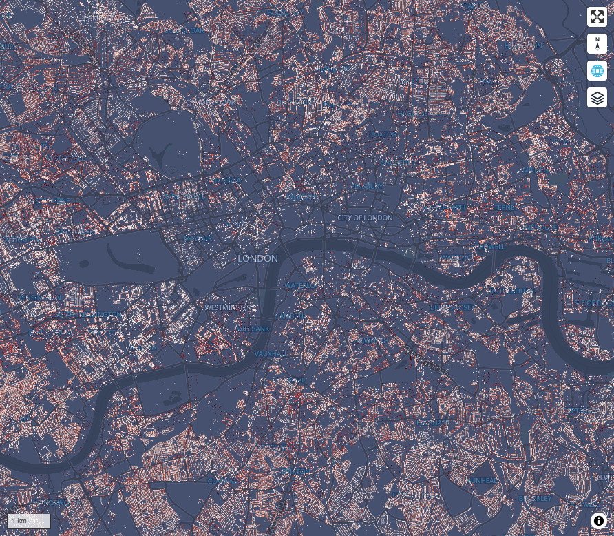
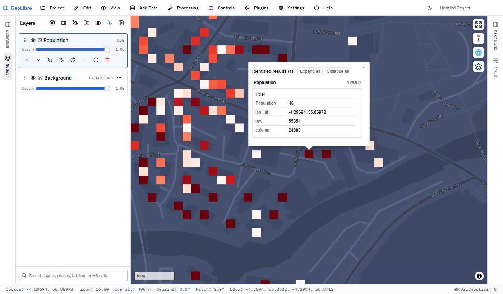
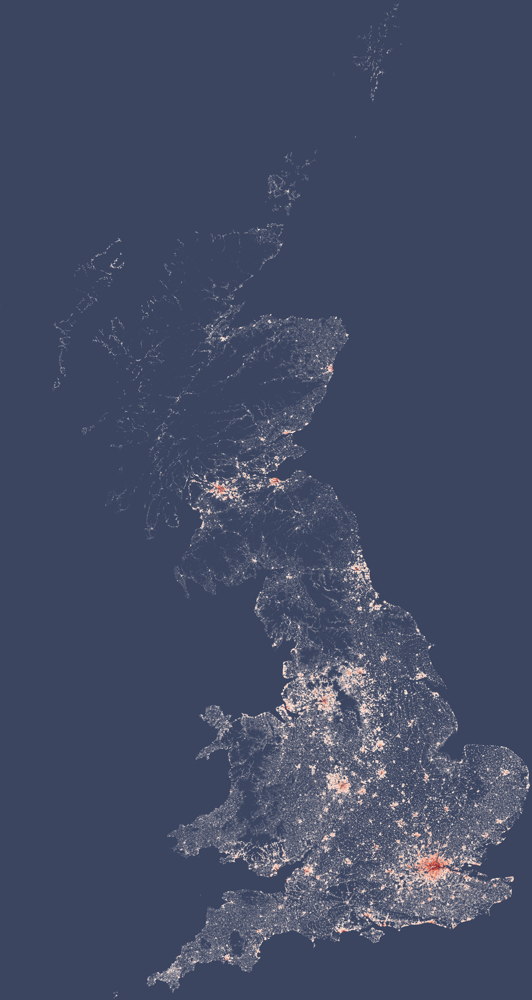

# GB-Census-Population-Map: Great Britain census map derived for UPRN data

Census population is published for areas: postcodes and output areas (OAs) of
roughly 100–150 households. This project shares those counts out to every
address in Great Britain, so population can be summed for any shape (a flood
zone, a 10 m grid cell, a catchment) instead of being tied to census
boundaries. It uses **Census 2021** for England and Wales and **Scotland's
Census 2022**, the **ONS UPRN Directory (ONSUD)** for address points, and
**OS Open Zoomstack** buildings to tell homes from addresses with nobody living
there. The result is a whole-person population for each of 41.6 million
addresses (UPRNs), 10 m population rasters, and an interactive map in
[GeoLibre](https://github.com/opengeos/geolibre).



## Idea

The census gives two sets of totals that both must hold: people per **postcode**
and people per **output area**. Addresses come from ONSUD, which places every
UPRN in its postcode and OA. The method shares each total among the addresses
that can plausibly house people:

1. **Postcode populations.** England and Wales use the Census 2021 postcode
   counts of usual residents. Scotland's postcode file counts only people in
   households, so communal-establishment residents (care homes, halls, prisons)
   are added per OA: all people (MV302) minus people in households (MV801),
   shared among the OA's postcodes by number of addresses.
2. **Address weights** from OS Open Zoomstack. An address outside any building
   (2 m tolerance) or inside an air, road or water transport site (airports,
   bus and coach stations, ports) gets weight 0. Addresses in education or medical sites get 0.25: they are mostly
   non-residential, but sites also hold halls of residence and care homes.
   Every other address gets 1.
3. **Fit to both totals.** Each postcode is split into postcode × OA cells,
   seeded by the summed address weights in each cell. Iterative proportional
   fitting adjusts the cells to match the postcode totals and the OA totals
   (TS001 for England and Wales, MV302 for Scotland). OA totals are first
   scaled to the official national totals, because published OA tables are
   slightly perturbed for disclosure control.
4. **Whole people.** Cells are rounded to whole people within each OA, then
   shared among the cell's addresses in proportion to weight. Both steps use
   largest-remainder rounding, so every total stays exact.
5. **Nobody lost.** A postcode or OA where every address weighs 0 falls back
   to weight 1 for each address. The 42 Scottish OAs with no ONSUD addresses
   get one point per OA instead.
6. **Rasters.** Addresses at identical coordinates (flats in one block) are
   combined, then summed into grid cells: 25 m and 10 m on the British
   National Grid for analysis, and a Web Mercator grid for web maps.

## Results

| | England & Wales | Scotland | Great Britain |
|---|---|---|---|
| Official census total | 59,597,542 | 5,439,842 | 65,037,384 |
| Postcode file total | 59,596,726 | 5,439,148 ¹ | |
| **Allocated (addresses + OA points)** | | | **65,037,384** |

¹ Household residents from the postcode file plus communal residents from the
OA tables.

- Every OA total is matched exactly, and so is the GB total. Postcode totals
  can't all be matched, because the postcode and OA tables disagree slightly:
  84.6% are exact, 98.7% within 1 person and 99.8% within 5.
- 31.7 million of 41.6 million addresses receive people (mean 2.05, median 2).
  Combining addresses at the same coordinates gives 25.9 million populated
  locations.
- The largest single cell holds 2,042 people, at Lyneham in Wiltshire: most
  likely the military base, counted as one communal establishment.

Known weaknesses:

- **Household sizes are averaged.** People are shared evenly within each
  postcode × OA cell, so most addresses get 2 or 3 people. The totals are
  right; the size of an individual household is not.
- **No building use.** Zoomstack has no building use, so non-residential
  addresses in ordinary buildings (high-street shops, offices) still get a
  share of their postcode's population.
- **Different years.** Addresses are from September 2026, the census is from
  2021 (Scotland 2022), so homes built since then also receive people.

## Map

`scripts/08_web_raster.py` builds a population raster for web maps. Points are
projected to Web Mercator and summed into the cells of the web map's zoom-13
tile grid: about 10–12 m on the ground across GB. Every cell lines up with a map
tile, so GeoLibre draws it without resampling. `scripts/09_geolibre_map.py`
opens it in GeoLibre in your browser, or use `notebooks/geolibre_population.ipynb`
in Jupyter or VS Code. Everything runs locally: GeoLibre's own small server
reads the GeoTIFF straight from disk.

The view is locked to GB, and the colour ramp runs from 1 to 20 people per
cell, since 99% of populated cells hold 16 or fewer. GeoLibre's **Identify**
tool (pointer icon above the layer list) shows the **Population** of any cell
you click:



Across Great Britain, rendered straight from `population_web_z13.tif` in the
same colours (people per cell from the zoomed-out levels, about 300 m pixels):



## Outputs (`data/processed/`)

| File | Contents |
|---|---|
| `onsud_uprn.parquet` | 41.6 M UPRNs as GeoParquet points (EPSG:27700) with postcode, country, region, local authority, Census 2021 OA/LSOA/MSOA codes and OA classification |
| `postcode_population_england_wales.parquet` / `.csv` | 1.38 M postcodes with usual residents |
| `postcode_population_scotland.parquet` / `.csv` | 153,192 postcodes with usual residents, communal residents included |
| `uprn_weights.parquet` | Per UPRN: in a building, Zoomstack site type, weight |
| `uprn_population.parquet` | Per UPRN: postcode and whole-person population |
| `centroid_population.parquet` | 42 points for Scottish OAs with no UPRN (3,954 residents) |
| `uprn_population_points.parquet` | GeoParquet of the 31.7 M populated UPRNs plus the OA points (uprn −1), for QGIS |
| `location_population_points.parquet` | GeoParquet of 25.9 M locations: UPRNs at identical coordinates combined (`uprns` = number combined) |
| `population_25m.tif`, `population_10m.tif` | Cloud Optimized GeoTIFFs of residents per cell, British National Grid (UInt16, nodata 0) |
| `population_web_z13.tif` | Cloud Optimized GeoTIFF in Web Mercator on the zoom-13 web tile grid (Float32, band "Population"); overviews average the populated cells, so sparse areas stay visible when zoomed out |

In ONSUD, placeholder codes such as `E99999999` ("not applicable") are stored
as nulls, and for Scotland `oa21cd` holds the 2022 output area codes.

## Repository layout

```
scripts/
  common.py                       shared helpers (NRS table reader, largest-remainder rounding)
  01_build_uprn_geoparquet.py     ONSUD regional CSVs -> one GeoParquet of UPRN points
  02_postcode_population.py       Census 2021 usual residents per postcode (England & Wales)
  03_postcode_population_scotland.py
                                  Census 2022 residents per postcode (Scotland), plus
                                  communal residents per OA
  04_uprn_weights.py              UPRN weights from OS Open Zoomstack buildings and sites
  05_uprn_population.py           population per UPRN in whole people, fitted to postcode
                                  and OA totals
  06_qgis_outputs.py              populated UPRN points and combined locations
  07_population_rasters.py        25 m and 10 m British National Grid population rasters
  08_web_raster.py                Web Mercator population raster on the zoom-13 tile grid
  09_geolibre_map.py              open the web raster in GeoLibre in your browser
notebooks/
  geolibre_population.ipynb       the same GeoLibre map inside Jupyter or VS Code
docs/images/                      map screenshots
environment.yml                   conda environment (conda-forge, GeoLibre from pip)
```

## Running it

```bash
conda env create -f environment.yml
conda activate census
python scripts/01_build_uprn_geoparquet.py
python scripts/02_postcode_population.py
python scripts/03_postcode_population_scotland.py
python scripts/04_uprn_weights.py
python scripts/05_uprn_population.py
python scripts/06_qgis_outputs.py
python scripts/07_population_rasters.py   # optional: rasters for QGIS/analysis
python scripts/08_web_raster.py
python scripts/09_geolibre_map.py         # opens the map; Ctrl+C to stop
```

The full pipeline handles 41.6 million addresses, so it needs plenty of memory
(it was run on a 40 GB machine). Scripts 07 and 08 take a few minutes each.

> **Windows note:** if PostgreSQL/PostGIS sets `PROJ_LIB` system-wide, rasterio
> picks up PostGIS's older PROJ database. The raster scripts point PROJ at
> rasterio's bundled copy themselves, so no setup is needed.

## Data

The input data is not included in this repository. Expected layout under `data/`:

| Path | Source | Licence |
|---|---|---|
| `uprn_postcode/ONSUD_*.csv` | [ONS UPRN Directory](https://geoportal.statistics.gov.uk/), September 2026, regional files | OGL v3; contains OS AddressBase-derived data |
| `census/EnglandWales.csv` | Census 2021 usual residents by postcode (P001) | OGL v3 |
| `census/TS001-*.csv` | Census 2021 TS001, usual residents by output area | OGL v3 |
| `census/Scotland.csv` | Scotland's Census 2022, households and people in households by postcode | OGL v3 |
| `census/test/outputarea/MV*.csv` | Scotland's Census 2022 multivariate tables by output area (MV302, MV801) | OGL v3 |
| `buildings/local_buildings.parquet`, `buildings/sites.parquet` | [OS Open Zoomstack](https://www.ordnancesurvey.co.uk/products/os-open-zoomstack) `local_buildings` and `sites`, exported from the GeoPackage with ogr2ogr | OGL v3 |

All data is in British National Grid (EPSG:27700), except the web raster
(EPSG:3857).

### Attribution

The maps and figures in this repository are derived from:

- Source: Office for National Statistics, licensed under the
  [Open Government Licence v3.0](https://www.nationalarchives.gov.uk/doc/open-government-licence/version/3/).
- Contains OS data © Crown copyright and database right 2026.
- Contains Royal Mail data © Royal Mail copyright and database right 2026.
- © Crown copyright. Data supplied by National Records of Scotland.
- Basemaps: [OpenFreeMap](https://openfreemap.org) © [OpenMapTiles](https://openmaptiles.org)
  © [OpenStreetMap contributors](https://www.openstreetmap.org/copyright).

## Licence

Code: [MIT](LICENSE). Data and derived maps: see [Attribution](#attribution).
